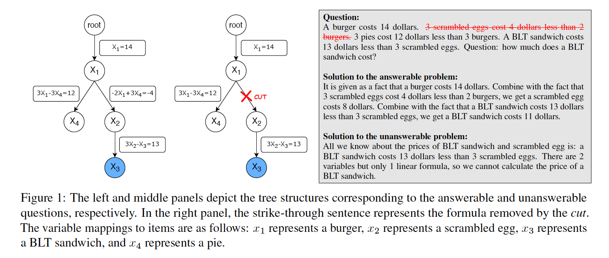

# TreeCut
The method was introduced in [TreeCut: A Synthetic Unanswerable Math Word Problem Dataset for LLM Hallucination Evaluation](https://arxiv.org/abs/2502.13442).

TreeCut is a synthetic dataset capable of systematically generating an infinite number of unanswerable math word problems and their answerable counterparts, by representing each problem as a tree and removing chosen necessary conditions. 
Experiments show TreeCut effectively induce hallucinations in large language models, including GPT-4o and o3-mini.

An illustration:



## Use TreeCut to Generate (Un)answerable Math Word Problems
Our code runs with base Python 3 without any additional dependencies. However, it is developed and tested using Python 3.11.
We recommend making a virtual environment:
```
python3.11 -m venv treecut
```
You can generate an unanswerable problems data file:
```
python generate_data_file.py --theme food --compositeName true --numVars 6 --ansDepth 4 --order random --hallu true --cutDepth 2 --verbose true
```
Generate an answerable problems data file:
```
python generate_data_file.py --theme food --compositeName true --numVars 6 --ansDepth 4 --order random --hallu false --verbose true
```
To understand the command-line arguments, please refer to Section 3 of the paper.

We also include several sample data file in
```commandline
sample_data/
```

## Citation
```bibtex
@article{ouyang2025treecut,
  title={TreeCut: A Synthetic Unanswerable Math Word Problem Dataset for LLM Hallucination Evaluation},
  author={Ouyang, Jialin},
  journal={arXiv preprint arXiv:2502.13442},
  year={2025}
}